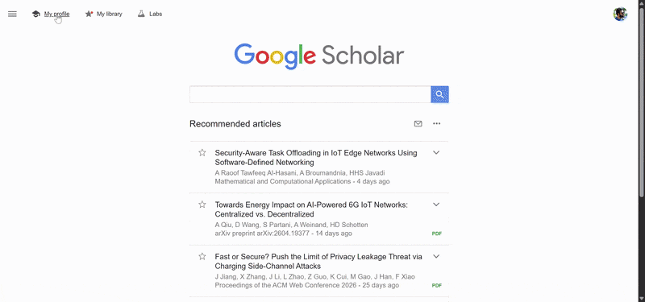

[](https://opensource.org/licenses/MIT)

# Google Scholar Venue Ranker (GSVR)

Google Scholar Venue Ranker is an open-source Chrome extension developed by [Naveed Bhatti](https://naveedanwarbhatti.github.io/). Its purpose is to make Google Scholar author profiles easier to audit by adding DBLP-verified CORE/SJR venue ranks, a raw fractional GSVR Score, scoring-completeness diagnostics, and downloadable evidence reports. When a paper can be verified, GSVR uses a DBLP-backed ranking pipeline instead of trusting editable Google Scholar venue text alone.

## Demo




<p align="left">
  <a href="https://chromewebstore.google.com/detail/egohghgpljdhkmcmllhncfndmkeilpfb?utm_source=item-share-cb">
    
  </a>
</p>

## Changelog

### Unreleased (phase 2)

- `Local journal resolution`: greatly expanded DBLP abbreviation coverage (`Mob.`, `Sel.`, `Mach.`, `Learn.`, `Knowl.`, `Softw.`, `Eng.`, `Empir.`, and ~30 more) plus a generic ambiguous-token variant system (`computer/computing/computation(al)`, `experience/experimental`, `security/secure`, ...). A 48-name battery of real DBLP journal renderings now resolves 48/48 locally with verified identities (previously 20/40, with the rest requiring slow network lookups).
- `Historical CORE snapshots`: bundled CORE 2013, ERA 2010, and CORE 2008 (downloaded from the CORE portal; converter in `scripts/convert_core_export.mjs`). Papers from 2008-2016 now consult era-appropriate snapshots instead of all being ranked by CORE 2014; for example SIGCOMM 2011 correctly shows ERA 2010's rank A rather than CORE 2014's A*.
- `Acronym/title cross-check`: a unique CORE acronym hit no longer auto-wins when the publication's full venue title describes a different conference. This fixes a class of generated-acronym collisions where, for example, the *Australasian Language Technology Workshop* was confidently ranked B via "Algorithmic Learning Theory" and a cryptography conference inherited rank A from Supercomputing.
- `Workshop signals`: a paper title containing `@` or the word "workshop" no longer misclassifies a main-track paper as a workshop paper; the X@Y notation now only counts when it appears in venue metadata.
- `Truncated titles`: Scholar titles ending in an ellipsis now prefix-match their DBLP record (with mandatory abstention when two records share the truncated prefix, and a minimum-length guard).
- `Publisher parentheticals`: SCImago titles like "Operating Systems Review (ACM)" now also register a parenthetical-stripped lookup key, so DBLP's "Oper. Syst. Rev." resolves.
- `Real-world benchmark suite`: new `real` fixture suite (91 cases) of genuine DBLP/Scholar query strings with human-verified identities and authority-data expected values — including identity traps for previously-merged journals and acronym-collision traps. Runs in CI alongside gold/shadow via `--suite all`.
- `Threshold tuning harness`: `npm run tune:thresholds` sweeps the publication-match similarity threshold over gold+real fixtures; current default 0.88 is measured optimal (raising it makes precision worse because abstention needs to see the runner-up candidate).

### Unreleased (phase 1)

- `SJR identity fix`: the compact SJR index is now keyed by SCImago `sourceId` instead of normalized title. The previous normalization silently merged 2,249 distinct journals onto 1,002 shared keys (883 with conflicting quartiles) and kept the best quartile, inflating ranks (for example, `Journal of Diabetes` inherited Q1 from `Diabetes`). Distinct journals now keep their own quartile histories; title-key collisions resolve via ISSN or exact-title evidence and otherwise abstain as ambiguous.
- `Shared journal matcher`: journal-name normalization and SJR matching moved into `GSVR/core/journal_match.js`, used identically by the content script, the Node test mirror, the SJR index generator, and the smoke test, so the four previous copies can no longer drift apart.
- `Unicode folding`: all matchers now fold diacritics and ligatures on both sides (`Müller` matches `Muller`, `Łukasz` matches `Lukasz`) via the new `GSVR/core/text_normalize.js`, fixing false `DBLP Entry Missing` results for accented titles, names, and venues.
- `Dedup`: removed the divergent duplicate Jaro-Winkler implementation and dead matcher code from the content script; string similarity now has a single canonical implementation in `rank_core.js`.
- `Coverage`: the Scholar domain list in the manifest now covers all 191 `scholar.google.*` ccTLD hosts (generated by `scripts/update_manifest_domains.mjs`); previously about 140 country domains, including `.com.co`, `.com.ar`, `.com.eg`, `.co.id`, and `.com.ph`, silently got no extension UI.
- `Icons`: replaced the three identical 450 KB non-square icon files with proper square 16/48/128 PNGs (25 KB total).
- `Repo hygiene`: release ZIPs are no longer committed; demo media moved out of the shipped extension folder to `docs/images`; added GitHub Actions CI (tests, accuracy benchmark with regression gate, build, size budget).
- `Tests`: new regression tests for the journal identity model (merged-journal quartiles, raw-title tie-breaks) and diacritic-folded matching; accuracy fixtures and baseline regenerated for the v3 index.

### 2.0.3

All changes from this update are part of the `2.0.3` release.

- `Versioning`: extension metadata, package metadata, build output, and README badges now use `2.0.3`.
- `Timeline range switch`: added a polished `Full Timeline` / `Last 10 Years` sidebar control. `Full Timeline` remains the default.
- `Filtered statistics`: switching date range now updates the score, completeness, CORE rank bars, SJR journal-rank bars, contributors, report payloads, and exports from the same filtered publication set.
- `Date windows`: `Last 10 Years` is anchored to the current calendar year; unknown-year publications are excluded from `Last 10 Years` statistics but retained in full-timeline aggregate counts.
- `Sidebar histograms`: replaced the old mixed rank histogram with two focused recent charts: stacked `A*/A` CORE papers and separate `Q1` journal papers.
- `Report histograms`: PDF Summary, PDF Full Report, and standalone HTML reports now include full-timeline `A*/A` CORE and `Q1` journal charts.
- `Report layout`: report charts are stacked vertically, with conference first and journal below. Each chart is full width, horizontal, and uses rotated year labels that stay inside the chart.
- `PDF page breaks`: report chart title, legend, and graph now move together as one block so the second graph title is not stranded on the previous page.
- `Visual polish`: restyled the sidebar toggle and timeline charts with cleaner spacing, stronger chart structure, improved bars, grid lines, count labels, and better report readability.
- `Historical SJR data`: added official SCImago journal CSV backfill for `1999` through `2009`, extending bundled SJR coverage to `1999` through `2024`.
- `Pre-1999 journals`: journal papers before `1999` are reported as historical SJR coverage unavailable instead of receiving an inferred 1999 quartile.
- `Tests`: added regression coverage for timeline filtering, CORE/SJR count recomputation, focused histograms, report chart layout, page-break behavior, historical SJR coverage, and unknown-year handling.
- `Docs`: README now serves as the release changelog going forward, starting with this `2.0.3` entry.

### 2.0.0

- `GSVR Score` panel with raw fractional venue scoring across eligible DBLP-verified CORE conferences and SJR journals
- `Scoring Completeness` diagnostics showing how much of the visible Scholar profile could be used in the score
- `Venue Ranker` sidebar with compact counts, interactive filters, and a cleaner score-first layout
- automatic two-pass scan: a fast first pass followed by a deeper background upgrade for better accuracy
- refreshed `Venue Explorer` for local CORE and SJR lookup
- richer report generation with PDF summary, full PDF audit, standalone HTML, and CSV exports
- modernized extension UI with tighter cards, clearer status states, and more polished dialogs

## 2.0 highlights

Version 2.0 is a major usability and workflow upgrade, not just a dataset refresh.

- `Scoring mechanism`: GSVR now includes a raw `GSVR Score` computed as the sum of venue-rank values divided by DBLP author counts for eligible ranked publications.
- `Report generation`: profiles can now be exported as a one-page PDF summary, a full PDF audit report, standalone HTML, or CSV for committees, self-audits, and sharing.
- `Fast scanning`: the extension now shows a fast first-pass result quickly, then improves the result in the background with a deeper second pass.
- `Better UI`: the sidebar, dialogs, status banners, score presentation, and download flows were redesigned to feel cleaner, more compact, and easier to use.

## Why GSVR exists

Google Scholar is excellent at collecting publications, but it does not make venue quality easy to inspect, compare, or audit. In Computer Science, Electrical Engineering, and closely related areas, venue information matters a lot, and it is often the first thing people want to sanity-check when browsing a profile.

GSVR brings that context directly into Scholar with:

- inline conference and journal badges beside papers
- a score-first sidebar for quick profile assessment
- a completeness diagnostic that separates scored publications from missing, ambiguous, unranked, or policy-excluded items
- local venue exploration without leaving Scholar
- explicit unranked and DBLP-missing states when GSVR abstains

## What the extension does

- Adds historical CORE conference ranks (`A*`, `A`, `B`, `C`) to conference papers.
- Adds SJR quartiles (`Q1`, `Q2`, `Q3`, `Q4`) to journal papers.
- Uses DBLP metadata as the authoritative source for venue extraction and disambiguation.
- Chooses the most appropriate CORE snapshot by publication year.
- Uses a compact prebuilt SJR index for faster journal lookup on Scholar pages.
- Shows a `GSVR Score` card above the ranking summary, using raw fractional venue scoring across eligible DBLP-verified publications.
- Switches profile statistics between full-timeline and last-10-years views without rescanning cached publications.
- Shows `Scoring Completeness` so users can see what share of the Scholar profile was usable for scoring.
- Shows a compact `Venue Ranker` panel for conference and journal distribution with a modernized sidebar UI.
- Shows focused yearly `A*/A` and `Q1` histograms in the sidebar and downloadable reports.
- Runs a fast first-pass scan, then upgrades results in the background with a deeper pass.
- Includes a local `Venue Explorer` dialog for ad hoc CORE and SJR checks.
- Includes a `Download Report` flow for one-page PDF summaries, full PDF audits, HTML, and CSV exports.
- Includes a popup and full settings page for behavior and UI defaults.
- Includes an in-product About panel and report-bug workflow.

## Ranking policy and rules

GSVR is intentionally conservative. It prefers abstaining over showing a confident-looking wrong rank.

## GSVR Score

The GSVR Score is a raw fractional venue score. It is computed as the sum of venue-rank values divided by the number of authors for each eligible DBLP-verified publication on a Google Scholar profile. Short papers, workshops, demos, posters, extended abstracts, preprints, ambiguous matches, missing DBLP records, unranked venues, and records without author counts are reported but not scored.

```text
GSVR = sum_i in E v_i / a_i
```

Where `E` is eligible DBLP-verified ranked publications, `v_i` is the CORE/SJR venue value, and `a_i` is the DBLP author count.

### Scoring Completeness

Scoring completeness measures the fraction of Scholar-visible publications that satisfy all requirements for inclusion in the GSVR Score: DBLP verification, eligible publication type, available venue rank, and valid author count. It is not a score multiplier; it is a coverage diagnostic that helps readers judge how representative the score is for the visible Scholar profile.

```text
Completeness = N_scored / N_total
```

Where `N_total` is the total Scholar publications discovered and `N_scored` is the number that were DBLP-verified, eligible, ranked by CORE/SJR, and had a valid author count.

```text
N_total =
N_scored
+ N_dblp_missing
+ N_ambiguous
+ N_rank_not_found
+ N_excluded_type
+ N_missing_author_count
+ N_lookup_unavailable
```

- DBLP is the trusted source for venue extraction.
  - Google Scholar profiles are user-editable.
  - DBLP entries cannot be freely added the same way, so venue metadata is more trustworthy for ranking decisions.
- CORE is used for conference ranking.
  - The extension bundles historical CORE datasets for `2014`, `2017`, `2018`, `2020`, `2021`, `2023`, and `2026`.
  - The publication year determines which ranking snapshot to consult.
- SJR is used for journal ranking.
  - The extension bundles official local SCImago CSVs for `1999` through `2024`.
  - A compact runtime index is generated at `GSVR/data/sjr-index.json` for faster lookup.
  - Journal papers before `1999` are marked as historical SJR coverage unavailable.
- Short conference papers under 6 pages are excluded.
  - This follows the same broad heuristic direction used by [CSRankings](https://csrankings.org/).
- Workshops, demos, posters, and extended abstracts are excluded from rank counting.
- Preprints, ambiguous matches, missing DBLP records, unranked venues, and records without DBLP author counts are reported but not scored.
- Ambiguous matches abstain.
  - If the extension cannot resolve a venue confidently, it prefers `N/A`, `Unranked`, or `DBLP Missing` over a risky guess.
- Proceedings-style journal cases are handled explicitly.
  - Some venues such as `PVLDB`, `PACMPL`, `POMACS`, `TOG`, `CGF`, and `TVCG` need venue-specific handling rather than naive string matching.

## Product surfaces

### Scholar profile overlay

On supported Google Scholar profile pages, GSVR injects:

- inline rank chips next to publication titles
- a `GSVR Score` panel
- a compact `Venue Ranker` panel with quick filters
- row highlighting for selected categories
- links for `DBLP Profile`, `Explore Venues`, `Download Report`, `Report Issue`, and `About`

GSVR intentionally does not inject UI on individual paper detail pages or Scholar search-results pages.

### Popup

The extension popup exposes quick controls for:

- `Run Automatically`
- `Compact Mode`
- `Show Unranked`
- `Default Highlight Mode`

### Full settings page

The options page adds:

- `Show Debug Details`
- persistent highlight defaults
- reset and save controls

### Venue Explorer

The built-in Venue Explorer is launched from the profile sidebar and lets you query local CORE and SJR datasets without leaving Google Scholar. This is useful for checking venue acronyms, aliases, merged venues, historical snapshots, or journal quartiles.

### Download Report

The profile-page report workflow exports the current audit in:

- PDF `Summary`
- PDF `Full Report`
- standalone HTML
- CSV

PDF and standalone HTML reports include full-width stacked `A*/A` CORE and `Q1` journal histograms with rotated year labels, while top-line report statistics follow the active sidebar date range.

### About panel

The About panel explains the extension's open-source status, authorship, ranking philosophy, and the main rules behind DBLP, CORE, SJR, and paper exclusion logic.

## Installation

### Option A: Chrome Web Store

Install from the Chrome Web Store using the badge above.

### Option B: Manual install from source or ZIP

1. Download a release ZIP from GitHub Releases, or use `Code -> Download ZIP` on GitHub and extract it.
2. Open `chrome://extensions`.
3. Enable `Developer mode`.
4. Click `Load unpacked`.
5. Select the folder that contains `manifest.json`.
   - If you built locally, load `dist/`.
   - If you are loading the raw extension source, load `GSVR/`.
6. Open a Google Scholar profile page such as `https://scholar.google.com/citations?user=...`.

## Local development

### Prerequisites

- Node.js 18 or newer

### Build the extension

From the repository root:

```bash
npm install
npm run build
```

This produces a clean unpacked extension in `dist/`.

### Regenerate the compact SJR index

```bash
npm run generate:sjr-index
```

Use this when official SJR CSVs are updated locally and you want to rebuild `GSVR/data/sjr-index.json`.

### Create a distributable ZIP

```bash
npm run zip
```

## Testing

### Fast regression and unit tests

```bash
npm test
```

These tests cover key ranking behavior such as:

- deterministic DBLP title matching
- workshop vs parent-conference disambiguation
- demo/poster detection
- short-paper exclusion from page ranges
- venue normalization and alias cleanup
- timeline range filtering and CORE/SJR count recomputation
- focused `A*/A` and `Q1` histogram generation

### Accuracy benchmark suite

GSVR also includes a separate ground-truth benchmark pipeline for ranking accuracy and latency evaluation.

Generate or refresh fixtures:

```bash
npm run benchmark:accuracy:fixtures
```

Run the gold benchmark suite:

```bash
npm run benchmark:accuracy -- --suite gold
```

Run all suites and refresh the stored baseline:

```bash
npm run benchmark:accuracy -- --suite all --write-baseline
```

Fail on benchmark regressions relative to the committed baseline:

```bash
npm run benchmark:accuracy -- --suite all --fail-on-regression
```

The benchmark system emits:

- per-family accuracy, precision, recall, abstain rate, ambiguity rate, and latency
- confusion matrices for status, conference rank, and journal quartile decisions
- JSON, Markdown, and HTML reports under `GSVR/tests/fixtures/accuracy/reports/`
- regression checks against `GSVR/tests/fixtures/accuracy/baseline.json`

## Repository layout

- `GSVR/` - extension source
- `GSVR/content.js` - Scholar page logic, ranking flow, summary panel, search dialog, About dialog
- `GSVR/inject.css` - injected Scholar UI styling
- `GSVR/rank_core.js` - shared ranking and matching logic
- `GSVR/venue_data.js` - venue aliases and proceedings/journal mapping data
- `GSVR/popup.*` - popup UI
- `GSVR/options.*` - full settings UI
- `GSVR/core/` - bundled CORE snapshots
- `GSVR/sjr/` - yearly official SCImago CSV files
- `GSVR/data/sjr-index.json` - compact generated SJR lookup index
- `GSVR/tests/` - unit tests, benchmark runner, fixtures, and reports
- `scripts/` - build, clean, zip, and SJR-index generation scripts
- `dist/` - build output created by `npm run build`

## Release and deployment checklist

For a GitHub or Chrome Web Store release:

1. Run `npm test`.
2. Run `npm run test:score`.
3. Run `npm run build`.
4. Load `dist/` from `chrome://extensions` with Developer mode enabled.
5. Manually verify that `Full Timeline` and `Last 10 Years` update the score, CORE bars, SJR bars, and focused sidebar histograms.
6. Export PDF Summary, PDF Full Report, and standalone HTML, then confirm the full-timeline `A*/A` and `Q1` histograms are stacked horizontal charts with uncropped rotated year labels.
7. Run `npm run zip` and upload the generated release ZIP.

## Data sources

The extension relies on three main authority sources:

- [DBLP](https://dblp.org/) for publication and venue metadata
- [CORE Conference Rankings](https://portal.core.edu.au/conf-ranks/) for conference ranks
- [SCImago Journal Rank](https://www.scimagojr.com/journalrank.php) for journal quartiles

Current bundled data coverage in this repository:

- CORE snapshots: `2008`, `2010` (ERA 2010), `2013`, `2014`, `2017`, `2018`, `2020`, `2021`, `2023`, `2026`
- SJR CSVs: `1999` through `2024`

As of May 2026, this repository does not bundle an official `2025` SJR CSV.

## Limitations

- Papers missing from DBLP may remain unranked or appear as `DBLP Missing`.
- Some venues are genuinely ambiguous and are intentionally left unresolved.
- Ranking policies in research are field-specific; GSVR focuses on DBLP plus CORE plus SJR rather than trying to aggregate every ranking system.
- The extension is designed for Google Scholar profile pages, not as a general-purpose citation-site rank overlay.

## Contributing and bug reports

Issues and pull requests are welcome.

If you report a ranking problem, please include:

- the Google Scholar profile URL
- the specific paper title
- the expected venue/rank behavior
- screenshots if the UI is involved
- console output if you are debugging locally

You can also use the in-product `Report` action from the summary panel.

## License

This project is licensed under the MIT License.

If the extension is useful to you, starring the repository helps more researchers find it.
