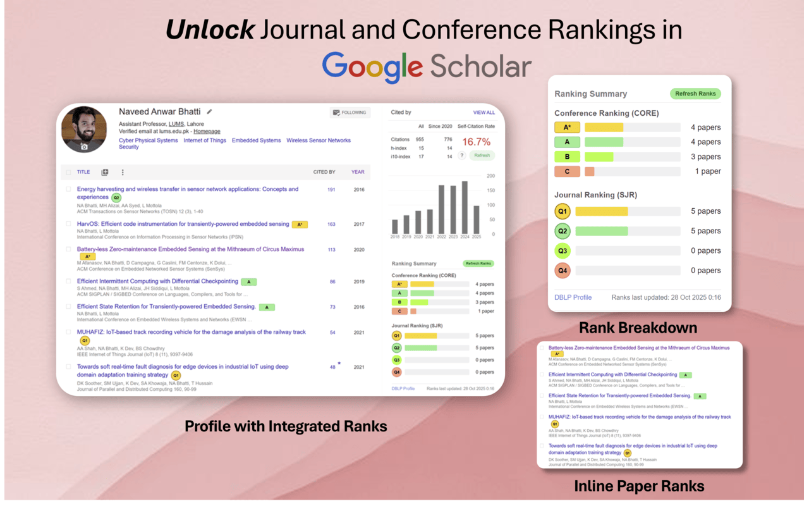

[](https://opensource.org/licenses/MIT)

# Google Scholar Venue Ranker (GSVR)

**Instantly see CORE conference rankings and SJR journal quartiles directly on Google Scholar profile pages—essential context for researchers in Computer Science, Electrical Engineering, and related fields.**

This Chrome extension enhances your Google Scholar experience by automatically fetching and displaying [CORE Conference Rankings](http://portal.core.edu.au/conf-ranks/) for conference publications alongside [SCImago Journal Rank (SJR)](https://www.scimagojr.com/) quartiles for journals. It helps you quickly assess the prestige of publication venues without leaving the Scholar page.



<p align="left">
  <a href="https://chromewebstore.google.com/detail/egohghgpljdhkmcmllhncfndmkeilpfb?utm_source=item-share-cb">
    
  </a>
</p>

### Why?

Google Scholar is great at collecting publications but **terrible at surfacing venue prestige**—a crucial signal in CS and EE. This extension overlays:

- **CORE** tiers for conferences/workshops (historical lists; rank chosen by publication year)
- **SJR** quartiles (Q1–Q4) for journals (by publication year)

---

## Features

| Feature | Description |
| --- | --- |
| 🎯 **Historical matching (CORE)** | Selects the appropriate CORE ranking list (2023, 2021, 2020, 2018, 2017, 2014) based on the publication year and applies multiple heuristics for matching. |
| 🏷 **Rank badges** | Shows color-coded A\*, A, B, C badges inline next to each conference paper title to reflect its historical rank. |
| 📚 **Journal insights (SJR)** | Adds SJR quartile badges (Q1–Q4) next to journal papers using local SCImago datasets. |
| 📊 **Summary panel** | Totals conference ranks (A\*, A, B, C, N/A) and SJR quartiles, aggregated across processed publications. |
| 🧹 **Name cleanup** | Removes trailing titles like "PhD" or "Dr." before DBLP lookup for better matches. |
| 🔎 **DBLP-assisted venue matching** | Uses DBLP publication metadata to detect venues and disambiguate abbreviated names. |

## Quick install

### Option A — Chrome Web Store

Install from the Chrome Web Store (link above).

### Option B — Manual install (ZIP / source)

1. **Download** a release ZIP from GitHub Releases (or click **Code → Download ZIP** on GitHub and extract).
2. **Load the extension in Chrome**:
   - Open `chrome://extensions`
   - Enable **Developer mode**
   - Click **Load unpacked**
   - Select the folder that contains `manifest.json`:
     - If your ZIP contains a **`GSVR/`** folder, select **`GSVR/`**.
     - If your ZIP contains a **`dist/`** folder, select **`dist/`**.
3. **Verify**:
   - Open a Scholar profile page (e.g., `https://scholar.google.com/citations?user=...`).
   - The extension should automatically run. You should see the progress bar, then the summary panel, and ranks next to papers.

---

## Build locally (for development)

### Prerequisites

- **Node.js 18+**

### Build

From the repo root:

```bash
npm install
npm run build
```

This creates a clean, loadable extension at `./dist/`.

Load it via **chrome://extensions → Load unpacked → select `dist/`**.

### Test

```bash
npm test
```

---

## Repository layout

- `GSVR/` — extension source (contains `manifest.json`, scripts, datasets)
- `dist/` — build output produced by `npm run build` (safe to load unpacked)
- `scripts/` — build/clean scripts used by npm

---

## Limitations & troubleshooting

- **DBLP coverage** — publications missing from DBLP may not be ranked.
- **Short papers** — conference papers under six pages are excluded as short papers.
- **Name mismatches** — DBLP may list your papers under a different name, leading to profile mismatches.

Tips:

- Verify your DBLP profile is correct and matches your Scholar name.
- Use the extension’s **Report Bug** link (in the summary panel) and include:
  - The Google Scholar profile URL
  - The specific paper/venue that was mismatched or not detected
  - The expected rank/behavior
  - Any console errors (if applicable)

If you’re debugging locally, open Chrome DevTools → **Console** on the Scholar page to see matching logs.

---

## Data sources & acknowledgements

This extension uses historical **CORE Conference Rankings** from **2023, 2021, 2020, 2018, 2017, and 2014**, and **SCImago Journal Rank (SJR)** data from [scimagojr.com](https://www.scimagojr.com/) (stored locally under `GSVR/sjr/`). It also uses **DBLP** metadata to identify venues and expand abbreviated journal names.

Please refer to the official [CORE portal](http://portal.core.edu.au/conf-ranks/) and [SCImago portal](https://www.scimagojr.com/journalrank.php) for the most authoritative data.

---

## Contributing & bug reports (BETA)

This extension is currently in BETA. Your feedback is invaluable!

- **Report a bug:** use the **Report Bug** link in the summary panel or open an issue on GitHub. When reporting, please include:
  - The Google Scholar profile URL
  - The specific paper/venue that was mismatched or not detected
  - The expected rank/behavior
  - Any console errors (if applicable)
- **Feature requests:** open an issue.
- **Pull requests:** contributions are welcome—please open an issue first to discuss significant changes.

---

## Future ideas

- Support for other ranking systems (e.g., Qualis, CCF).
- User-configurable settings (e.g., preferred ranking system, option to hide N/A).
- More advanced venue name disambiguation.

---

## License

This project is licensed under the MIT License.

⭐ **Like it?** Give the repo a star—helps other researchers discover the extension!
